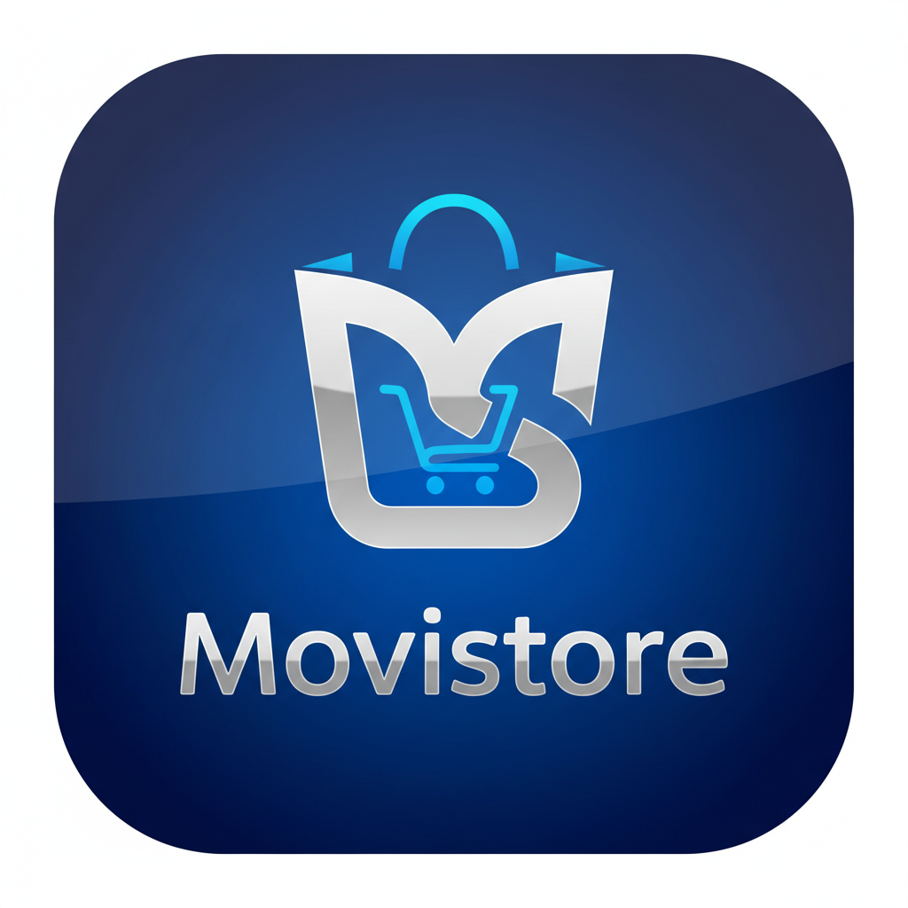

# 📱 MoviStore - Aplicación Móvil de E-commerce

<div align="center">
  
  <h3>Gestión Integral de Tienda de Celulares y Accesorios</h3>
  
  [](https://reactnative.dev/)
  [](https://expo.dev/)
  [](https://www.typescriptlang.org/)
  [](https://www.nativewind.dev/)
  
  <p>
    <a href="https://expo.dev/artifacts/eas/qtrS65QZUsvReSodn1PHBq.apk">
      
    </a>
  </p>
</div>

---

## 📖 Tabla de Contenidos

- [🎯 Acerca del Proyecto](#-acerca-del-proyecto)
- [✨ Características Principales](#-características-principales)
- [🛠️ Tecnologías y Stack](#️-tecnologías-y-stack)
- [📸 Capturas de Pantalla](#-capturas-de-pantalla)
- [🚀 Instalación y Configuración](#-instalación-y-configuración)
- [📋 Scripts Disponibles](#-scripts-disponibles)
- [🏗️ Arquitectura del Proyecto](#️-arquitectura-del-proyecto)
- [🔧 Variables de Entorno](#-variables-de-entorno)
- [📱 Compilación de APK](#-compilación-de-apk)
- [🎯 Roadmap](#-roadmap)
- [👨‍💻 Autor](#-autor)
- [📄 Licencia](#-licencia)

---

## 🎯 Acerca del Proyecto

**MoviStore** es una aplicación móvil desarrollada como proyecto escolar que digitaliza la gestión de una pequeña cadena de tiendas especializada en celulares y accesorios. La empresa cuenta con una sede principal en Tapachula y 2 sucursales, buscando modernizar su sistema de ventas que anteriormente se manejaba con notas y libretas.

### 🎯 Objetivo Principal
Proporcionar una solución tecnológica completa que permita:
- **Para Clientes**: Explorar catálogo, realizar compras y gestionar pedidos
- **Para Administradores**: Control total del inventario, productos y ventas por sucursal
- **Para el Negocio**: Registro detallado de ventas y control de stock en tiempo real

### 👥 Público Objetivo
Orientado principalmente a **pequeños emprendedores** que buscan digitalizar sus negocios y mejorar la experiencia de sus clientes.

---

## ✨ Características Principales

### 🛍️ **Para Clientes**
- **Catálogo Interactivo**: Navegación intuitiva por productos y categorías
- **Carrito de Compras**: Agregar, modificar y eliminar productos fácilmente
- **Gestión de Pedidos**: Seguimiento completo del estado de las órdenes
- **Búsqueda Avanzada**: Filtros por categoría, sucursal y términos específicos
- **Autenticación Segura**: Sistema de registro y login con validación

### 👨‍💼 **Para Administradores**
- **Dashboard Administrativo**: Panel de control con métricas importantes
- **Gestión de Productos**: CRUD completo con carga de imágenes
- **Control de Inventario**: Actualización de stock por sucursal en tiempo real
- **Gestión de Categorías**: Organización y administración del catálogo
- **Administración de Sucursales**: Control de ubicaciones y stock
- **Gestión de Pedidos**: Seguimiento y actualización de estados

### 🏪 **Funcionalidades del Sistema**
- **Multi-sucursal**: Gestión independiente del inventario por ubicación
- **Responsive Design**: Interfaz adaptativa y moderna
- **Navegación Intuitiva**: Estructura clara con tabs y drawer navigation
- **Validación Robusta**: Esquemas de validación con Zod
- **Manejo de Estados**: Context API para gestión global del estado

---

## 🛠️ Tecnologías y Stack

### 📱 **Frontend Móvil**
- **React Native** `0.81.4` - Framework principal para desarrollo móvil
- **Expo** `~54.0.10` - Plataforma de desarrollo y deployment
- **TypeScript** `5.9.2` - Tipado estático para mayor robustez
- **NativeWind** `4.2.1` - Tailwind CSS para React Native

### 🎨 **UI/UX y Navegación**
- **React Navigation** `7.x` - Navegación con Stack, Tabs y Drawer
- **Expo Vector Icons** - Iconografía completa y profesional
- **React Native Gesture Handler** - Gestos y animaciones fluidas
- **React Native Reanimated** - Animaciones de alto rendimiento

### 🔧 **Herramientas y Utilidades**
- **Axios** - Cliente HTTP para comunicación con API
- **AsyncStorage** - Persistencia local de datos
- **Zod** - Validación de esquemas y formularios
- **UUID** - Generación de identificadores únicos
- **Expo Image Picker** - Selección y manipulación de imágenes

### 🛠️ **Desarrollo y Build**
- **ESLint** - Linting y calidad de código
- **EAS Build** - Compilación de APK/IPA nativas
- **Metro** - Bundler optimizado para React Native
- **Babel** - Transpilación de JavaScript moderno

---

## 📸 Capturas de Pantalla y Demo

### 🎬 **Video Demostración**

<div align="center">
  <video width="300" controls>
    <source src="https://res.cloudinary.com/dydi57qrk/video/upload/v1759900952/testeo_rdnjzf.mp4" type="video/mp4">
    Tu navegador no soporta el elemento de video.
  </video>
  
  **🎥 [Ver Demo en Video](https://res.cloudinary.com/dydi57qrk/video/upload/v1759900952/testeo_rdnjzf.mp4)** - Funcionalidades principales de MoviStore
</div>

### 📷 **Capturas de Pantalla**

<div align="center">
  <table>
    <tr>
      <td align="center">
        
        <br/><b>🏠 Pantalla de Inicio</b>
      </td>
      <td align="center">
        
        <br/><b>🏠 Catalogo</b>
      </td>
      <td align="center">
        
        <br/><b>📦 Gestión de Pedidos</b>
      </td>
      <td align="center">
        
        <br/><b>🔔 Sistema de Notificaciones</b>
      </td>
    </tr>
  </table>
</div>

> **📲 ¿Quieres probarlo?** [Descarga la APK demo aquí](https://expo.dev/artifacts/eas/qtrS65QZUsvReSodn1PHBq.apk)

---

## 🚀 Instalación y Configuración

### 📋 Prerrequisitos

Asegúrate de tener instalados:
- **Node.js** `≥ 18.0.0`
- **npm** o **yarn**
- **Expo CLI**: `npm install -g @expo/cli`
- **EAS CLI** (para builds): `npm install -g eas-cli`

### ⚡ Instalación Rápida

```bash
# Clona el repositorio
git clone https://github.com/Angel-bit-24-6/movistoreFrontend.git
cd movistoreFrontend

# Instala las dependencias
npm install

# Inicia el servidor de desarrollo
npm start
```

### 📱 Ejecutar en Dispositivos

**Opción 1: Usando npm scripts**
```bash
# Inicia el servidor de desarrollo
npm start

# Ejecuta directamente en plataformas específicas
npm run android    # Android
npm run ios        # iOS (requiere macOS)
npm run web        # Web (experimental)
```

**Opción 2: Directamente con Expo CLI (método más común)**
```bash
# Inicia el servidor de desarrollo
npx expo start

# O ejecuta directamente en plataformas específicas
npx expo start --android    # Android
npx expo start --ios        # iOS (requiere macOS)
npx expo start --web        # Web (experimental)
```

> 💡 **Recomendación**: `npx expo start` es la forma más estándar y común de trabajar con proyectos Expo.

---

## 📋 Scripts Disponibles

| Script | Descripción | Equivalente Expo CLI |
|--------|-------------|---------------------|
| `npm start` | Inicia Expo DevTools | `npx expo start` |
| `npm run android` | Ejecuta en Android | `npx expo start --android` |
| `npm run ios` | Ejecuta en iOS | `npx expo start --ios` |
| `npm run web` | Ejecuta versión web | `npx expo start --web` |
| `npm run lint` | Ejecuta ESLint | - |
| `npm run lint:fix` | Corrige errores de lint | - |

---

## 🏗️ Arquitectura del Proyecto

```
src/
├── 📁 components/          # Componentes reutilizables
│   ├── Layout/            # Header, Pagination
│   ├── Modals/            # Modales del sistema  
│   └── Toast/             # Sistema de notificaciones
├── 📁 context/            # Contextos globales (Auth, Cart, Store, Toast)
├── 📁 features/           # Módulos por funcionalidad
│   ├── auth/             # Autenticación y autorización
│   ├── products/         # Gestión de productos
│   ├── categories/       # Administración de categorías
│   ├── stores/           # Gestión de sucursales
│   ├── cart/             # Carrito de compras
│   ├── checkout/         # Proceso de checkout
│   └── orders/           # Gestión de pedidos
├── 📁 navigation/         # Configuración de navegación
├── 📁 services/          # Servicios de API y utilidades
├── 📁 hooks/             # Custom hooks reutilizables
├── 📁 schemas/           # Esquemas de validación Zod
├── 📁 types.ts           # Definiciones de TypeScript
└── 📁 utils/             # Funciones utilitarias
```

### 🎯 **Patrones de Arquitectura**
- **Feature-based**: Organización por módulos funcionales
- **Context Pattern**: Gestión de estado global
- **Custom Hooks**: Lógica reutilizable y separación de concerns
- **Schema Validation**: Validación robusta con Zod
- **Service Layer**: Abstracción de llamadas a API

---

## 🔧 Variables de Entorno

Crea un archivo `.env` en la raíz del proyecto (si prefieres manejarlo de manera convencional):

```env
# URL del Backend API
API_URL=https://tu-backend-api.com/api/v1

# Configuración opcional para desarrollo local
# API_URL=http://192.168.1.100:5000/api/v1
```

### ⚙️ Configuración en app.config.js

La aplicación utiliza `app.config.js` para manejar las variables de entorno de manera dinámica:

```javascript
const apiUrl = process.env.API_URL ?? 'https://movistorebackend.onrender.com/api/v1';
```

---

## 📱 Compilación de APK

### 🔨 Build de Desarrollo
```bash
# Compila APK para pruebas
eas build -p android --profile development
```

### 🚀 Build de Producción
```bash
# Compila APK optimizada para distribución
eas build -p android --profile production
```

### 📊 Configuración EAS (eas.json)
- **Development**: APK con debugging habilitado
- **Production**: APK optimizada con `autoIncrement` de versión
- **iOS Support**: Configuración lista para builds de iOS

---

## 🎯 Roadmap

### 🚀 **Próximas Características**
- [ ] **Notificaciones Push**: Alertas de nuevos productos y ofertas
- [ ] **Modo Offline**: Funcionalidad básica sin conexión
- [ ] **Reportes Avanzados**: Analytics y métricas de ventas
- [ ] **Chat de Soporte**: Comunicación directa con la tienda
- [ ] **Programa de Lealtad**: Sistema de puntos y recompensas
- [ ] **Pagos Integrados**: Múltiples métodos de pago

### 🔧 **Mejoras Técnicas**
- [ ] **Performance**: Optimización de carga y memoria
- [ ] **Testing**: Implementación de tests unitarios y E2E
- [ ] **CI/CD**: Pipeline automatizado de deployment
- [ ] **Accesibilidad**: Mejoras para usuarios con discapacidades

---

## 👨‍💻 Autor

<div align="center">
  
  
  **Angel**
  
  *Desarrollador Full Stack | Estudiante*
  
  [](https://github.com/tu-usuario)
  [](https://linkedin.com/in/tu-perfil)
</div>

### 🎓 **Contexto Académico**
Este proyecto fue desarrollado como parte del curso **"Desarrollo de Aplicaciones Web y Móviles"** con el objetivo de aplicar conocimientos teóricos en un caso de uso real y proporcionar una solución práctica para pequeños emprendedores.

---

## 📄 Licencia

Este proyecto es de **uso académico** y está en **mejora continua**. 

```
📚 Proyecto Académico - MoviStore
🎯 Propósito: Educativo y de demostración
🚀 Estado: En desarrollo y mejora continua
💡 Contribuciones: Solo con fines académicos
```

---

<div align="center">
  <p><strong>¿Te gustó el proyecto? ¡Dale una ⭐ si te sirvió de inspiración!</strong></p>
  
  
  
  
  ---
  
  **MoviStore** - *Digitalizando el comercio, un celular a la vez* 📱✨
</div>
